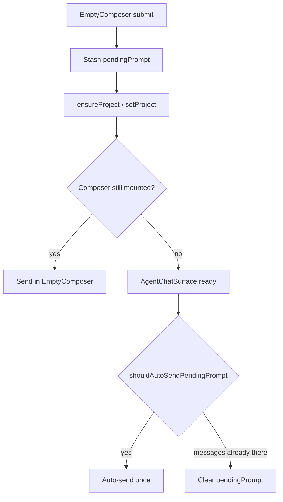

# Walkthrough

Walk the change the way an author would: **intent first, then a path through the code**, not a file-tree dump. Each stop pairs a short why with the smallest visual that makes the point.

This is a **comprehension tour**, not a review. Findings → [quick-review](../quick-review/SKILL.md). Dual-pass audit → [thermos](../thermos/SKILL.md).

Write the tour **in chat** as structured markdown. Do not write a tour file unless the user asks for one.

Worked example: [examples.md](examples.md).

## Resolve the change

Pick the smallest scope that matches the request:

| User points at | Collect |
|----------------|---------|
| PR URL / number | `gh pr view`, `gh pr diff` |
| Current branch / "my PR" | `gh pr view --json` if a PR exists; else merge-base diff vs default base |
| Local / uncommitted work | Working tree vs merge-base (committed + staged + unstaged unless they said committed-only) |

If scope is ambiguous, ask once. Do not guess a random branch.

Then read: PR body / commit messages, the full diff, and **surrounding code** for every significant hunk (callers, stores, tests). A tour that only restates the diff is useless.

## Cluster into stops

Reorganize by **reviewer comprehension**, never alphabetical or tree order.

1. **Causal / data-flow order** — stash before bootstrap before send; write before read; producer before consumer.
2. **One theme per stop** — a behavior, invariant, or handoff. Multiple files can share a stop if they are the same idea (prop plumbing, test files).
3. **Lead with the surprising path** — the race, the guard, the carry-through. Mechanical wiring last.
4. **Roll up** tests and leftover plumbing into their own compact stops. Do not walk every test file.

A typical tour has **4–8 stops**. Collapse tiny related hunks. Split a stop only when two independent questions would get tangled.

## Output shape

```markdown
## Overview
<1–3 sentences: what was broken or missing, what this change keeps intact, and the mechanism.>

## Review focuses
- **<invariant>:** <what the reviewer must confirm, in one sentence of context>
- **<invariant>:** ...

## <Theme title>
### <Stop subtitle>
<N files · +X −Y>

<2–6 sentences of why, then what. Name the guards and failure paths.>

<one visual — see toolkit>

<focused code excerpt>

**Watch:** <the easy-to-miss guard or contract>
**Confirm:** <optional Yes/No — only when there is a real review question>
```

After the theme stops:

- **Tests** — file count + line stats + what is covered. Quote a test only if it encodes the invariant better than prose.
- **Leftover plumbing** — files that only thread props/types/imports. Path + stats + one sentence. No hunks unless a name is surprising.

## Each stop

**Title** is the theme (`Pending prompt handoff`). **Subtitle** is the concrete move (`Stash before bootstrap`).

**Stats** are honest: files touched *in this stop*, plus/minus for those files.

**Prose** is reviewer-facing. Lead with why. Mention the contract that must stay intact. Call out failure behavior (`on failure it clears the stash and keeps the textarea`).

**Code** is a focused excerpt with path and line range — the changed shape plus just enough context to read it. Prefer a small before/after or a unified hunk over a whole function. Never paste an unchanged file.

**Questions** are specific (`auto-send must no-op when a message already exists`) not generic (`does this look right?`). Skip them when the stop is mechanical.

## Visual toolkit

Pick the **smallest** view that makes the key point. Place it next to the sentence it supports. One visual per stop unless two answer different questions. You will not use every form.

**Pseudocode** — algorithm, guards, short-circuits:

```text
on(submit)
  if prompt blank → return false
  if no currentChatId → stash pendingPrompt
  try ensureProject + send
  on failure → clear stash, keep textarea
```

**Call tree** — runtime control flow / ownership:

```text
submitPrompt
  stash pendingPrompt          # only when no chat
  ensureProject
    ensureActiveProjectChat    # project exists, no chat
    bootstrapProjectWithChat   # else
  onSendPrompt
```

**Component tree** — UI structure, state, module boundaries:

```tsx
<AgentChatSurface>
  shouldAutoSendPendingPrompt()
  <EmptyComposerView>
    submitPrompt()
```

**File tree** — responsibility or a broad refactor (shallow):

```text
packages/agent/src/agent/
├── chat/components/     # stash + auto-send
├── chat/hooks/          # ensure chat on active project
└── state/slices/        # carry selectedModel
```

**Mermaid** — component interaction, control flow, or data flow:



**Shape diff** — when the point is what changed and the surrounding shape already exists. Match the diff to the topic (component, files, call tree, or control flow):

```diff
 submitPrompt
   ensureProject
+    stash pendingPrompt
   onSendPrompt
-  always clear textarea
+  clear textarea only if handedOff
```

**Full block** — only when most of it is new, omitted context would hide ownership or order, or the user needs a copyable target shape.

For a visual UI, layout, or concept too dense for Mermaid, a single focused HTML artifact is allowed if the host can open a local file. Match the product's colors and labels. Otherwise stay in markdown.

## Hard rules

- **Tour, don't review.** Pose confirm questions; do not pad with findings. If you spot a real bug, one short note at the end is enough — then point at [quick-review](../quick-review/SKILL.md).
- **Never invent hunks.** Quote the real diff. If you did not read the surrounding code, do not narrate it.
- **Never walk files in tree order.** Never dump full files or the entire patch.
- **Skip noise.** Formatting, import reorder, generated code, and type re-exports belong in leftover plumbing or nowhere.
- **Keep prose brief.** The visual and the hunk should carry the stop. Two sentences beat a paragraph.
- **Failed paths matter.** If the change stashes, seeds, or carries state, say what happens on failure.
- **Do not implement fixes** in this skill.
